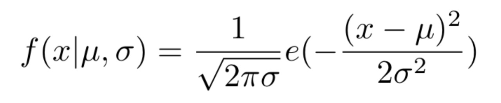

### Questões sobre a biblioteca Numpy

* 1 a 5 - Ézio Freire
* 6 a 10 - Pedro Medeiros
* 11 a 15 - Kaleb Zimmermann
* 16 a 20 - Douglas Barbosa

---
1. O que é Numpy?

NumPy é uma biblioteca numérica para a linguagem de programação Python,  uma biblioteca para  que possamos armazenar criar e manipular dados de forma eficiente, para se trabalhar com diversas funções e operações matemática sofisticadas, (data science, inteligência artificial de forma geral) incluindo mas não se limitando a:

* Objeto array para a implementação de arranjos multidimensionais; 
* Objeto matrix para o cálculo com matrizes; Ferramentas para álgebra linear; Transformadas de Fourier básicas;
* Ferramentas sofisticadas para geração de números aleatórios.

---
2. O que fará o programa a seguir:

```python
import numpy as np # importação da biblioteca numpy e é atribuído um apelido a ela denominado np, que poderia ser qualquer outro apelido, mas que por padrão é melhor usar o np mesmo.
arr = np.array([-9, 1, 7], dtype=np.float32) # criada uma variável chamada arr e atribuído a ela np.array( [ -9, 1, 7] ) passando entre colchetes como argumento os valores -9, 1, 7, e ainda na segunda linha com dtype=np.float32, será definido o tipo de dados do objeto, nesse caso float e o tamanho dos dados, nesse caso 32 bits.
print(repr(arr)) # será impresso o array([-9.,  1.,  7.], dtype=float32)
```

* na linha 01, ocorre a importação da biblioteca numpy e é atribuído um apelido a ela denominado np, que poderia ser qualquer outro apelido, mas que por padrão é melhor usar o np mesmo.<br/>
* na linha 02 é criada uma variável chamada arr e atribuído a ela np.array( [ -9, 1, 7] ) passando entre colchetes como argumento os valores -9, 1, 7, e ainda na segunda linha com dtype=np.float32, será definido o tipo de dados do objeto, nesse caso float e o tamanho dos dados, nesse caso 32 bits.
na <br/>
* linha 03 será impresso o array([-9.,  1.,  7.], dtype=float32)

---
3. Qual a diferença do programa da questão número para o programa a seguir:

A diferença entre o programa anterior (exercício 2) é basicamente que desta vez temos um array bidimensional.

```python
import numpy as np
arr = np.array([[10, 11, 12], [21, 22, 23]],
dtype=np.float32)
print(repr(arr))
```
R = a diferença entre o programa anterior(exercício 2) é basicamente que desta vez temos um array bidimensional.</br></br>

---
4. Quando fazemos referencia a um array o que o Python faz? E qual a diferença para o copy?

Quando fazemos uma referência, se modificarmos o valor da “nova da nova variável” a variável que foi referenciada será modificada, com o copy isso não acontece pois modificamos apenas a cópia e não a variável original.

```python
a = np.array([0, 1])
b = np.array([2, 3])
c = a
print('Array a: {}'.format(repr(a)))
c[0] = 99
print('Array a: {}'.format(repr(a)))

d = b.copy()
d[0] = -11
print('Array b: {}'.format(repr(b)))
```

R = Quando fazemos uma referência, se modificarmos o valor da “nova da nova variável”  a variável que foi referenciada será modificada, com o copy isso não acontece pois modificamos apenas a cópia e não a variável original.</br></br>

---
5. O que faz a função astype (dê um exemplo)</br>
a função astype() cria uma cópia da matriz e permite que você especifique o tipo de dados como um parâmetro.

```python
arr = np.array([1.2,  2.1,  3.4])      #ndarray tipo float                                
print (arr)                            # saída [1.2, 2.1, 3.4]
newarr = arr.astype(‘int’)             
print(newarr)                          # saída [1, 2, 3] uma cópia do arr chamada newarr desta vez int conforme solicitado no astype                             
print(newarr.dtype)                    # aqui será impresso o tipo e o espaço que pode ocupar em bits                                   
```

---
6. Quando devemos usar np.nan?

NaN é a abreviação de Not a number. É usado para representar entradas não definidas, e tambem valores faltantes em datasets

```python
import numpy as np
arr = np.array([1, np.nan, 3, 4, 5, 6, np.nan]) 
pritn(arr) 

[ 1. nan  3.  4.  5.  6. nan]
```

---
7. Explique np.inf e -np.inf

np.inf é um numero infinito que pode ser valores positivos ou negativos. Usado para medir perfomance e algoritmos

```python
np.inf # infinito positivo
np.ninf # infinito negativo
```

---
8. Explique o funcionamento de arange

O np.arange() é um método Numpy que retorna o objeto ndarray contendo 
valores uniformemente espaçados dentro de um determinado intervalo
usa quatro parâmetros que incluem  start, stop, step  e dtype

```python
arr = np.arange(5)
print(repr(arr)) - [0,1,2,3,4]
```

---
9. Faça um exemplo de código com np.reshape
```python
import numpy as np

array = np.arange(8)
print("Original array : \n", array)

array = np.arange(8).reshape(2, 4)
print("\narray reshaped with 2 rows and 4 columns : \n", array)

# Original array : 
# [0 1 2 3 4 5 6 7]

# array reshaped with 2 rows and 4 columns : 
# [[0 1 2 3]
# [4 5 6 7]]
```

---
10. Para que serve np.transpose, np.zeros, np.ones, np.zeros_like, np.ones_like - aproveite e de um exemplo de cada em um programa

- **np.transpose()**: inverte a dimensão de um array
```python
a = np.arange(6).reshape((3,2))
np.transpose(a)
#resultado array([[0, 2, 4],[1, 3, 5]])
```

- **np.zeros()**: retorna uma nova matriz de dado formato e tipo, com zeros
```python
b = np.zeros(2, dtype = int)
#resultado array([0 0])
```

- **np.ones()**: retorna uma nova matriz de forma e tipo fornecidos, com uns.
```python
b = np.ones(2, dtype = int)
#resultado array([1 1])
```

- **np.zeros_like()**: Este método numpy retorna uma matriz de determinada forma e tipo como matriz fornecida, com zeros. 
```python
array = np.arange(10).reshape(5, 2)
#resultado [[0 1] [2 3] [4 5] [6 7] [8 9]]

b = np.zeros_like(array, float)
#resultado [[0. 0.] [0. 0.] [0. 0.] [0. 0.] [0. 0.]]
```

- **np.ones_like()**: retorna um array de dado formato e tipo como um dado array, com uns. 
```python
array = np.arange(10).reshape(5, 2)
#resultado [[0 1] [2 3] [4 5] [6 7] [8 9]]

b = np.ones_like(array, float)
#resultado [[1. 1.] [1. 1.] [1. 1.] [1. 1.] [1. 1.]]
```

---
11. O que é aritmética multidimensional com python e de um exemplo de como usar

A aritimética multidimensional com Python possibilita realizar as operações básicas da matemática com arrays. Exemplo:
```python
arr1 = [1, 2, 3]
arr2 = [4, 5, 6]

print(np.multiply(arr1, arr2)) # Multiplica os valores dos dois arrays. Resultado: [4, 10, 18]
print(np.add(arr1, arr2)) # Soma os valores dos dois arrays. Resultado: [5, 7, 9]
print(np.subtract(arr1, arr2)) # Subtrai os valores dos dois arrays. Resultado: [-3, -3, -3]
print(np.divide(arr1, arr2)) # Divide os valores dos dois arrays. Resultado: [0.25, 0.4, 0.5]
```

---
12. Explique a linha de código abaixo da linha pontilhada no programa a seguir

```python
arr = np.array([[2, 4], [6, 9]])
# Imprime o exponencial de todos os valores dentro do array (e^x onde e = Número de Euler). Similar a 2.718281^2, 2.718281^4 ...
print(repr(np.exp(arr)))
# Imprime 2 elevado a cada um dos valores do array. Similar a 2^2, 2^4, 2^6, 2^9
print(repr(np.exp2(arr)))

arr2 = np.array([[1, 10], [np.e, np.pi]])
# Imprime o cálculo do logaritmo natural de cada valor do array. Atenção para np.e = Número de Euler, np.pi = valor de PI
# Similar a logₑ(1), logₑ(10)
print(repr(np.log(arr2)))
# Imprime o cálculo do logaritmo natural de cada valor do array com base 10 ao invés de e. Similar a log10(1), log10(10)
print(repr(np.log10(arr2)))
# Imprime 3 elevado a potência de cada item do array. Similar a 3^1, 3^10
print(repr(np.power(3, arr2)))
# Calcula x^2 onde x é o valor de cada item do array
print(repr(arr**2))
```

---
13. Como fazer a multiplicação de matrizes usando Numpy

```python
arr1 = [1, 2, 3]
arr2 = [2, 3, 3]

print(np.multiply(arr1, arr2)) # [2, 6, 9]
```

---
14. Por que usamos np.random.seed?
O np.random.seed faz com que os números "alteatórios" sejam previsíveis, ou seja, será mostrada sempre a mesma sequência de números ao utilizar o numpy.random.rand

---
15. O que faz e como funciona np.random.shuffle?
O np.random.shuffle embaralha um array. Exemplo:
```python
arr = [1, 2, 3, 4, 5]
np.random.shuffle(arr)
print(arr) # [4, 5, 1, 3, 2]
```

---
**16.  O que é uma distribuição "normal"?**

```python

print(np.random.uniform())
print(np.random.uniform(low=-1.5, high=2.2))
print(repr(np.random.uniform(size=3)))
print(repr(np.random.uniform(low=-3.4, high=5.9,
size=(2, 2))))
```

- A distribuição normal (também chamada de gaussiana) é um valor aleatório gerado dentro de um intervalo de valores desejado, utiliza um valor de meio e um valor de desvio padrão, calculado pela equação da Figura abaixo.



- Distribuição normal.
No qual μ (mu) representa o valor da média e σ (sigma) representa um desvio padrão (portanto para mais ou para menos).

- Gerando uma distribuição normal, em que a média é o valor 0 e o desvio padrão é 1,

---
**17.  Explique o programa usando as linhas pontilhadas**
```python

import numpy as np
arr = np.array([[0, 2, 3],
                [1, 3, -6],
                [-3, -2, 1]])
# ..........................verifica dentro de todo o array se o valor de cada posição representa o número 3 e retorna true ou false
print(repr(arr == 3))
# ..........................verifica dentro de todo o array se o valor de cada posição é maior que 0 e retorna true ou false
print(repr(arr > 0))
# ..........................verifica dentro de todo o array se o valor de cada posição é diferente de 1 e retorna true ou false
print(repr(arr != 1))
# ..........................verifica dentro de todo o array se o valor de cada posição é igual a 1 e retorna true ou false
print(repr(~(arr != 1)))

```

---
**18. Como somar e concatenar arrays**
para somar arrays  podemos  utilizar o comando np.concatenate(a,b), onde tam,bém podemos adicionar mais parametros para definir a linha do array que sera concatenada.

---
**19. Como funciona np.save e np.load**

- np.save: Esta função recebe um nome de arquivo e uma matriz como argumentos e salva a matriz no formato txt. csv entre outros.
- np.load: Carrega matrizes de arquivos, podendo ser txt. csv entre outros.

---
**20. Use as linhas pontilhadas para explicar**
```python
arr = np.array([[0, 72, 3],
                [1, 3, -60],
                [-3, -2, 4]])
# arr.min() procura na matriz inteira o menor, arr.min() procura na matriz inteira o menor valor
print(arr.min())
print(arr.max())
# procura na matriz o menor valor em cada linha
print(repr(arr.min(axis=1)))
# Calcula a média aritmética ao longo do eixo especificado
print(np.mean(arr))
# Calcula a variação ao longo do eixo especificado
print(np.var(arr))
# Calcule a mediana ao longo do eixo especificado.
print(np.median(arr))

